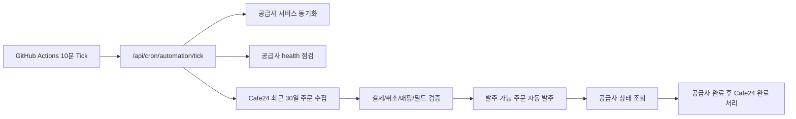

# Order Automation Stability Plan

이 문서는 Cafe24 주문 수집, MKT24 panel API 전환, 공급사 자동화, Cron 운영 상태를 실제 운영 기준으로 점검하기 위한 기준 문서다.

## 현재 운영 구조

## MKT24 Panel API 기준

- MKT24 공급사 endpoint는 `https://api.mkt24.co.kr/v3/panel`을 사용한다.
- 인증은 기존 API key 기반 `key + action` 방식이다.
- Bearer token은 사용하지 않는다.
- 서비스 목록은 `action=services`로 동기화한다.
- 주문은 `action=add`로 전송하며 panel service ID는 숫자형 `service` 값이어야 한다.
- 기존 v3 상품 UUID 형태의 매핑은 panel 주문에 사용할 수 없으므로 자동 발주 전 `mkt24_panel_service_id_invalid`로 차단한다.
- MKT24 공급사는 저장, 연결 테스트, 부트 보정 단계에서 Bearer token을 비운다.

## Cafe24 OAuth/주문 수집 기준

- Cafe24 access token은 만료 임박 또는 만료 시 refresh token으로 자동 갱신한다.
- refresh token 만료, 폐기, 앱 권한 철회는 OAuth 정책상 서버가 무인 복구할 수 없다.
- refresh token 복구 불가 상태는 `reconnect_required`로 저장하고 관리자 Cafe24 탭에서 재연결 액션을 요구한다.
- 주문 수집은 최근 30일, `order_date` 기준, `limit=1000`, `maxPages=30`으로 조회한다.
- 주문 상태는 최대한 수집하고 내부에서 결제완료, 결제대기, 취소/환불, 검수필요로 분리한다.
- 주문 처리 단위는 Cafe24 `order_id`가 아니라 `order_item_code`다.
- 중복 키는 `mall_id + shop_no + order_id + order_item_code`다.

## Cron 운영 기준

### GitHub Actions

- `.github/workflows/automation-tick.yml`
  - 10분마다 `/api/cron/automation/tick` 호출
  - 운영 payload:
    - `lookbackDays=30`
    - `supplierSyncLimit=10`
    - `supplierHealthLimit=10`
    - `cafe24PageLimit=1000`
    - `cafe24MaxPages=30`
    - `cafe24DetailFetchLimit=200`
    - `dispatchLimit=25`
    - `statusLimit=50`
    - `completionLimit=25`
- `.github/workflows/supplier-service-sync.yml`
  - 30분마다 `/api/cron/suppliers/sync` 호출
  - supplier sync limit은 `10`
- `.github/workflows/cafe24-operational-audit.yml`
  - 운영 DB, Cafe24 token, mapping, order item, supplier 상태를 read-only로 점검한다.
- `.github/workflows/cafe24-mapping-gaps.yml`
  - 매핑 누락 품목을 product/variant/custom product code 단위로 묶고 Cafe24 상품 상세를 조회한다.
- `.github/workflows/cafe24-preflight-one.yml`
  - 특정 `order_id + order_item_code`가 발주 가능한지 read-only로 검증한다.
- `.github/workflows/cafe24-manual-input-one.yml`
  - 개인결제처럼 옵션에서 수량/대상을 자동 추출할 수 없는 품목에 공급사, 서비스, 대상, 수량을 저장하고 preflight를 다시 실행한다.
  - 대상 URL/계정은 workflow input에 직접 넣지 않고 `target_secret_name`이 가리키는 GitHub Secret에서 읽는다.
  - 이 workflow는 발주를 호출하지 않는다.
- `.github/workflows/cafe24-manual-input-preview-one.yml`
  - 수동 보정과 같은 입력으로 공급사 payload와 preflight 결과를 preview한다.
  - DB를 수정하지 않으며 대상 URL/계정 원문은 응답에 노출하지 않는다.
  - 결과의 `preflight.canDispatch`가 `true`가 아니면 저장/발주 단계로 진행하지 않는다.
- `.github/workflows/cafe24-dispatch-one.yml`
  - 먼저 preflight를 실행하고 `canDispatch=true`인 경우에만 단건 발주 endpoint를 호출한다.

### 인증

- 권장 인증은 GitHub Secret `CRON_SECRET`과 Vercel `CRON_SECRET`을 같은 값으로 맞추는 방식이다.
- 현재 서버는 GitHub Actions 헤더 검증 fallback도 지원한다.
- `SMM_PANEL_AUTOMATION_PAUSED=1`이면 수집은 허용하고 발주/완료 처리는 중단한다.

## 자동 발주 안전 조건

자동 발주는 아래 조건을 모두 만족할 때만 가능하다.

- Cafe24 주문상품이 결제완료 상태다.
- 취소, 환불, 교환, 반품 상태가 아니다.
- Cafe24 상품/옵션이 공급사 서비스에 매핑되어 있다.
- 필수 입력값 추출이 성공했다.
- 공급사와 공급사 서비스가 active 상태다.
- 공급사 service sync가 성공 상태다.
- 공급사 health가 `ok`다.
- 이미 supplier order가 생성되지 않았다.
- retry 제한을 초과하지 않았다.
- MKT24 panel 매핑은 숫자형 service ID다.

조건 미충족 주문은 자동 재발주하지 않고 `needs_manual_review` 또는 명확한 실패 코드로 남긴다.

## 실패 처리 기준

- Cafe24 token 재연결 필요: `reconnect_required`
- 결제 전 주문: 발주 금지
- 취소/환불 주문: 발주 금지
- 매핑 누락: 검수 필요
- 필드 추출 실패: 검수 필요
- MKT24 v3 UUID 매핑: `mkt24_panel_service_id_invalid`
- 공급사 timeout 또는 supplier order ID 누락: 중복 발주 방지를 위해 관리자 확인 필요
- 공급사 완료 전 Cafe24 완료 처리 금지
- Cafe24 완료 처리 실패는 발주 재시도가 아니라 완료 처리 재시도 큐에 남긴다.

## 운영 점검 체크리스트

- `/api/health`가 HTTP 200을 반환한다.
- GitHub Actions `Instamart Automation Tick` 최근 실행이 success다.
- 관리자 Cafe24 탭의 마지막 자동 수집 시각이 10분 단위로 갱신된다.
- Cafe24 최근 30일 주문 수집 결과의 `responseOrderCount`, `storedOrderItemCount`가 실제 주문과 일치한다.
- `reviewRequiredCount`가 존재하면 매핑/필드/서비스 ID를 우선 점검한다.
- MKT24 공급사 서비스 동기화 결과가 service count `0`이 아니다.
- MKT24 공급사 카드에 Bearer token 보유 표시가 없어야 한다.
- 자동 발주 실패 건은 `automation_error_code`와 운영 메모를 확인한다.

## 현재 검증된 상태

- 2026-05-26 `Cafe24 Operational Audit` run `26446788786` 기준:
  - 운영 runtime은 production, DB backend는 Postgres다.
  - Cafe24 integration은 1개이며 token status는 `connected`다.
  - Cafe24 mapping은 12개가 enabled/auto dispatch enabled 상태다.
  - Cafe24 order item은 10개이며 `waiting_input=8`, `ready_to_submit=1`, `completed=1`이다.
  - 공급사는 3개, supplier service는 4161개다.
- 2026-05-26 `Cafe24 Mapping Gaps` run `26446788793` 기준:
  - product `32`, `33`, `34` 개인결제 품목 8건이 매핑 없음 상태다.
  - 세 상품 모두 단일 variant code만 확인되며 수량 후보는 없다.
  - detail lookup warning은 없다.
- 2026-05-26 `Cafe24 Preflight One` run `26446788675` 기준:
  - `20260512-0000017` / `20260512-0000017-01`은 `canDispatch=false`다.
  - 차단 사유는 `status_waiting_input`, `mapping_missing`, `supplier_mapping_missing`, `supplier_payload_missing`, `quantity_mismatch`, `supplier_missing`이다.
- 현재 신규 발주 가능 대상은 아직 없다.
  - product `12`의 최근 ready/completed 품목은 이미 `supplierOrderUuid`가 있어 재발주하면 안 된다.
  - product `32`, `33`, `34`는 수동 보정 또는 명시적 매핑이 먼저 필요하다.

## 단건 운영 발주 절차

개인결제 품목을 발주하려면 아래 순서를 지킨다. 이 절차는 고객 대상값과 수량이 운영자가 확인된 경우에만 진행한다.

1. `Cafe24 Mapping Gaps`를 실행해 대상 `product_no`, `variantCode`, `customProductCode`, `orderId`, `orderItemCode`를 확인한다.
2. 관리자 Cafe24 상품 조회 또는 mapping gap 상세에서 Cafe24 상품이 개인결제인지, 자동 수량 후보가 없는지 확인한다.
3. 공급사 상태에서 사용할 `supplierId`와 active `supplierServiceId`를 선택한다.
4. 대상 URL/계정은 GitHub Secret에 저장하고, secret 이름만 `Cafe24 Manual Input One`의 `target_secret_name`에 입력한다.
5. `Cafe24 Manual Input Preview One`을 실행한다.
   - 필수 입력은 `Cafe24 Manual Input One`과 동일하다.
   - 이 단계는 DB를 변경하지 않는다.
   - 결과의 `supplierPayload.hasTarget`, `supplierPayload.hasQuantity`, `quantity.matchesExpected`, `preflight.canDispatch`를 확인한다.
6. `Cafe24 Manual Input One`을 실행한다.
   - 필수 입력: `mall_id`, `shop_no`, `order_id`, `order_item_code`, `supplier_id`, `supplier_service_id`, `target_secret_name`, `ordered_count`.
   - `expected_quantity`는 비워두면 `ordered_count`를 사용한다.
   - 결과의 `preflight.canDispatch`가 `true`가 아니면 발주하지 않는다.
7. `Cafe24 Preflight One`을 같은 품목과 수량으로 다시 실행한다.
   - `canDispatch=true`
   - `paymentGateStatus=payment_confirmed`
   - `mapping.supplierId`, `mapping.supplierServiceId`, `supplierPayload.hasTarget`, `supplierPayload.hasQuantity`가 모두 확인되어야 한다.
8. `Cafe24 Dispatch One`을 실행한다.
   - workflow는 내부에서 preflight를 한 번 더 실행하고 실패 시 발주 endpoint를 호출하지 않는다.
   - 발주 성공 후 supplier order uuid가 저장됐는지 `Cafe24 Operational Audit` 또는 관리자 Cafe24 큐에서 확인한다.

## 다음 운영 액션

1. `Cafe24 Manual Input Preview One`을 운영에 반영한다.
2. product `32`, `33`, `34` 중 실제 고객 대상값과 수량이 확인된 품목 1개를 선택한다.
3. 선택한 품목에 대해 `Cafe24 Manual Input Preview One`을 실행하고 DB 변경 없이 `canDispatch=true`가 되는지 확인한다.
4. 같은 입력으로 `Cafe24 Manual Input One`을 실행해 수동 보정을 저장한다.
5. 같은 품목을 `Cafe24 Dispatch One`으로 단건 발주한다.
6. 단건 발주 후 supplier order uuid, 공급사 상태 조회, Cafe24 완료 처리 큐를 순서대로 확인한다.
