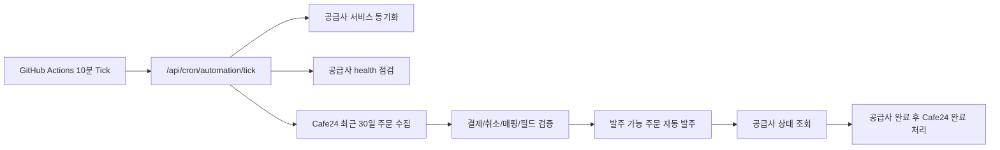

# Order Automation Stability Plan

이 문서는 Cafe24 주문 수집, MKT24 panel API 전환, 공급사 자동화, Cron 운영 상태를 실제 운영 기준으로 점검하기 위한 기준 문서다.

## 현재 운영 구조

## MKT24 Panel API 기준

- MKT24 공급사 endpoint는 `https://api.mkt24.co.kr/v3/panel`을 사용한다.
- 인증은 기존 API key 기반 `key + action` 방식이다.
- Bearer token은 사용하지 않는다.
- 서비스 목록은 `action=services`로 동기화한다.
- 주문은 `action=add`로 전송하며 panel service ID는 숫자형 `service` 값이어야 한다.
- 기존 v3 상품 UUID 형태의 매핑은 panel 주문에 사용할 수 없으므로 자동 발주 전 `mkt24_panel_service_id_invalid`로 차단한다.
- MKT24 공급사는 저장, 연결 테스트, 부트 보정 단계에서 Bearer token을 비운다.

## Cafe24 OAuth/주문 수집 기준

- Cafe24 access token은 만료 임박 또는 만료 시 refresh token으로 자동 갱신한다.
- refresh token 만료, 폐기, 앱 권한 철회는 OAuth 정책상 서버가 무인 복구할 수 없다.
- refresh token 복구 불가 상태는 `reconnect_required`로 저장하고 관리자 Cafe24 탭에서 재연결 액션을 요구한다.
- 주문 수집은 최근 30일, `order_date` 기준, `limit=1000`, `maxPages=30`으로 조회한다.
- 주문 상태는 최대한 수집하고 내부에서 결제완료, 결제대기, 취소/환불, 검수필요로 분리한다.
- 주문 처리 단위는 Cafe24 `order_id`가 아니라 `order_item_code`다.
- 중복 키는 `mall_id + shop_no + order_id + order_item_code`다.

## Cron 운영 기준

### GitHub Actions

- `smm_panel/.github/workflows/cafe24-order-poll.yml`
  - 10분마다 `/api/cron/automation/tick` 호출
  - 운영 payload:
    - `lookbackDays=30`
    - `supplierSyncLimit=10`
    - `supplierHealthLimit=10`
    - `cafe24PageLimit=1000`
    - `cafe24MaxPages=30`
    - `cafe24DetailFetchLimit=200`
    - `dispatchLimit=25`
    - `statusLimit=50`
    - `completionLimit=25`
- `smm_panel/.github/workflows/supplier-service-sync.yml`
  - 30분마다 `/api/cron/suppliers/sync` 호출
  - supplier sync limit은 `10`

### 인증

- 권장 인증은 GitHub Secret `CRON_SECRET`과 Vercel `CRON_SECRET`을 같은 값으로 맞추는 방식이다.
- 현재 서버는 GitHub Actions 헤더 검증 fallback도 지원한다.
- `SMM_PANEL_AUTOMATION_PAUSED=1`이면 수집은 허용하고 발주/완료 처리는 중단한다.

## 자동 발주 안전 조건

자동 발주는 아래 조건을 모두 만족할 때만 가능하다.

- Cafe24 주문상품이 결제완료 상태다.
- 취소, 환불, 교환, 반품 상태가 아니다.
- Cafe24 상품/옵션이 공급사 서비스에 매핑되어 있다.
- 필수 입력값 추출이 성공했다.
- 공급사와 공급사 서비스가 active 상태다.
- 공급사 service sync가 성공 상태다.
- 공급사 health가 `ok`다.
- 이미 supplier order가 생성되지 않았다.
- retry 제한을 초과하지 않았다.
- MKT24 panel 매핑은 숫자형 service ID다.

조건 미충족 주문은 자동 재발주하지 않고 `needs_manual_review` 또는 명확한 실패 코드로 남긴다.

## 실패 처리 기준

- Cafe24 token 재연결 필요: `reconnect_required`
- 결제 전 주문: 발주 금지
- 취소/환불 주문: 발주 금지
- 매핑 누락: 검수 필요
- 필드 추출 실패: 검수 필요
- MKT24 v3 UUID 매핑: `mkt24_panel_service_id_invalid`
- 공급사 timeout 또는 supplier order ID 누락: 중복 발주 방지를 위해 관리자 확인 필요
- 공급사 완료 전 Cafe24 완료 처리 금지
- Cafe24 완료 처리 실패는 발주 재시도가 아니라 완료 처리 재시도 큐에 남긴다.

## 운영 점검 체크리스트

- `/api/health`가 HTTP 200을 반환한다.
- GitHub Actions `Instamart Automation Tick` 최근 실행이 success다.
- 관리자 Cafe24 탭의 마지막 자동 수집 시각이 10분 단위로 갱신된다.
- Cafe24 최근 30일 주문 수집 결과의 `responseOrderCount`, `storedOrderItemCount`가 실제 주문과 일치한다.
- `reviewRequiredCount`가 존재하면 매핑/필드/서비스 ID를 우선 점검한다.
- MKT24 공급사 서비스 동기화 결과가 service count `0`이 아니다.
- MKT24 공급사 카드에 Bearer token 보유 표시가 없어야 한다.
- 자동 발주 실패 건은 `automation_error_code`와 운영 메모를 확인한다.

## 현재 검증된 상태

- MKT24 `/v3/panel` `action=services` 호출이 성공했고 서비스 231개가 동기화되었다.
- Cafe24 최근 30일 주문 수집에서 주문 8건, 주문상품 8개가 저장되었다.
- 현재 자동 발주 대상은 0건이며, 8건은 검수 필요 상태다.
- 검수 필요의 주된 원인은 Cafe24 상품/옵션과 MKT24 panel 숫자형 service ID 재매핑 필요로 본다.

## 다음 운영 액션

1. 관리자 Cafe24 탭에서 검수 필요 주문 8건의 상품/옵션을 확인한다.
2. Cafe24 상품/옵션을 새로 동기화된 MKT24 panel service ID에 직접 매핑한다.
3. 정규화/공급 payload preview에서 `service`, `link`, `quantity` 값이 생성되는지 확인한다.
4. 단건 수동 발주로 공급사 주문 ID가 반환되는지 확인한다.
5. 동일 매핑의 다음 주문부터 자동 발주 대상이 되는지 GitHub Actions tick 결과로 확인한다.
